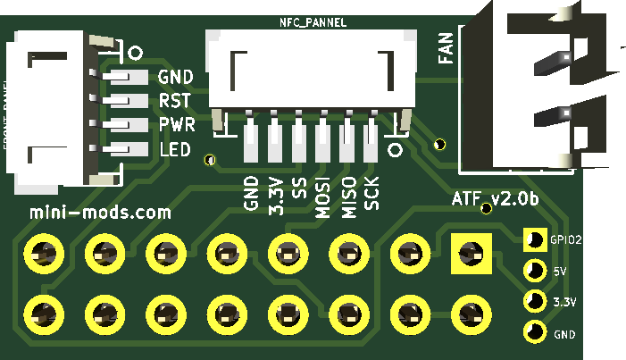

Manual Pick and Place Automatic Tape Feeder
===============================
This code controll the ON and OFF of the Automatic Tape Feeder (ATF)on a manual Pick and Place Machine.


License
-------
<div align="center"><a rel="license" href="https://creativecommons.org/licenses/by-nc-sa/4.0/"></a><br /></div>

This project is licensed under the Attribution-NonCommercial-ShareAlike CC BY-NC-SA 4.0 license. The full legal text of the license may be found in the LICENSE.txt file in this repository. For more information about this license, please visit 
the Creative Commons Foundation (https://creativecommons.org/licenses/by-nc-sa/4.0/).

Features
--------

* Soft-shutdown Pi from power switch

* Reset button functionality

* Easy Temperature Control

* 2 wire fan control

* One-line script installation

----------

ATF Control Board
--------

Front Side:


Back Side


----------

Software Installation
---------------------

**NOTE**: This assumes that you have already connected the ATF board and the **POWER button is pressed**;

This instructions are a *step-by-step guide* to install the necessary software for the **Automatic Tape Feeder Module**.

----------

Open a SSH terminal session and type the one-line installation command below:
```bash
$ wget -O - "https://github.com/mafe72/Manual-Pick-and-Place-Automatic-Tape-Feeder/raw/master/install.sh" | sudo bash
```
----------
The script will automatically install pertinent files and configure your Raspberry Pi to enable the **Automatic Tape Feeder Module.**
Installation will automatically reboot once all processes are completed.

After rebooting, the **Automatic Tape Feeder Module** is now fully functional.

Software Uninstall
---------------------

This instructions are a *step-by-step guide* to uninstall the software for the **Automatic Tape Feeder Module**.

----------

Open a SSH terminal session and type the one-line uninstall command below:
```bash
$ wget -O - "https://github.com/mafe72/Manual-Pick-and-Place-Automatic-Tape-Feeder/raw/master/uninstall.sh" | sudo bash
```

The script will automatically uninstall all configuration files from your Raspberry Pi to disable the **Automatic Tape Feeder Module.**
The uninstall script will automatically shutdown once all processes are completed.

After shutdown, the **Automatic Tape Feeder Module** will be fully deactivated.

----------
	
Basic Usage
-----------

* POWER ON
			
		While powered off
			Press (LATCH) POWER button
			LED will turn ON
			Wait for Raspberry Pi to boot		
* POWER OFF
		
		While powered on
			Press (Unlatch) POWER button
			LED will turn OFF
			Wait for Raspberry Pi to shutdown	
* RESET

		Press the Reset button
		LED will BLINK
		Wait for Raspberry Pi to reboot
		
* Fan control
		FAN will turn ON if CPU temp exceeded 55C and turn OFF when CPU temp is under 40C

----------
	
Troubleshooting
-----------

